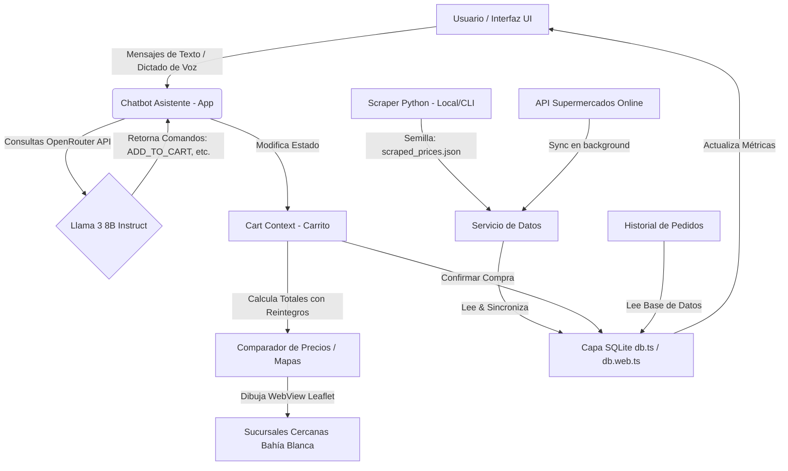

# AhorraBot 🤖🛒
> Asistente Inteligente de Ahorro y Comparador de Precios en Supermercados de Bahía Blanca.

AhorraBot es una aplicación multiplataforma desarrollada en **React Native / Expo** diseñada para ayudar a las familias de Bahía Blanca a combatir la inflación mediante la comparación inteligente de precios, la generación automática de listas de compras optimizadas y el cálculo en tiempo real de descuentos y reintegros bancarios (como Cuenta DNI, Coopeplus, etc.).

---

## 🏗️ Arquitectura de la Aplicación

La aplicación se estructura en capas desacopladas que integran servicios de inteligencia artificial (LLMs), bases de datos SQLite persistentes, procesamiento de voz local y servicios de extracción web en tiempo real:



---

## 🌟 Características Principales

### 1. Chatbot Inteligente con Control de Estado 🤖💬
El asistente conversacional interactúa usando modismos locales bahienses ("che", "La Coope", "gatillar"). Al procesar las solicitudes del usuario, es capaz de interpretar intenciones y devolver tags de comandos estructurados:
* `[ADD_TO_CART: productId]`: Carga productos al carrito automáticamente.
* `[REMOVE_FROM_CART: productId]`: Remueve cantidades de la lista.
* `[CLEAR_CART]`: Vacía el carrito del usuario.

### 2. Base de Datos SQLite Híbrida (Nativa & Web) 🗄️💾
Implementación de persistencia local robusta usando `expo-sqlite` para compilaciones nativas Android/iOS y `localStorage` con fallback reactivo para navegadores web:
* Guarda las órdenes de compra generadas (`orders`): tienda seleccionada, productos adquiridos, costo total, ahorros aplicados y fecha.
* Almacena en caché local las listas de productos y precios para garantizar el funcionamiento offline.
* Actualiza en tiempo real el indicador de **"Mi Ahorro Estimado"** en la pantalla principal.

### 3. Comparador Inteligente de Canastas y Tarjetas 💳🗺️
Calcula el costo total del carrito de compras comparando simultáneamente cuatro grandes supermercados en Bahía Blanca:
* **Cooperativa Obrera (La Coope)**
* **Carrefour Market**
* **Vea Supermercados**
* **Hiper ChangoMás**

El algoritmo aplica automáticamente los descuentos vigentes (por ejemplo, *20% de reintegro en La Coope*, *Cuenta DNI los fines de semana*, *Descuentos con Tarjeta Coopeplus*) y te recomienda a qué sucursal dirigirte para realizar la compra más económica.

### 4. Dictado de Voz Inteligente y Háptico 🎙️⚡
Permite agregar productos mediante comandos de voz gracias a la integración de `@dev-amirzubair/react-native-voice` compatible con la Nueva Arquitectura de React Native:
* Gestiona flujos asincrónicos de solicitud de permisos del micrófono en Android e iOS.
* Dispara sutiles respuestas hápticas (`expo-haptics`) al activar/desactivar la escucha.
* Proporciona un modo de simulación y asistencia visual inteligente para emuladores que carecen de hardware de reconocimiento de voz.

### 5. Scraper de Precios Bahía Blanca 🕷️📊
Contiene un script independiente en Python (`scrape_bahia.py`) que:
* Consulta las APIs internas y catálogos online de los supermercados locales bajo geolocalización de Bahía Blanca.
* Genera una base semilla en JSON (`scraped_prices.json`) para pre-cargar la app al iniciar.
* Escribe reportes detallados en texto plano (`productos_bahia_blanca.txt`) con estadísticas y variaciones de costos.

---

## 🛠️ Tecnologías y Dependencias

* **Framework**: React Native / Expo (v54.0.x)
* **Lenguaje**: TypeScript
* **Estilado**: Styled Components
* **Base de Datos**: `expo-sqlite` / LocalStorage
* **Mapas**: Leaflet API renderizado en WebView nativo
* **IA**: Integración con OpenRouter API (Llama 3)
* **Reconocimiento de Voz**: `@dev-amirzubair/react-native-voice` (New Architecture ready)
* **Scraper**: Python 3 (Urllib / JSON)

---

## 📦 Estructura del Código

```bash
ahorrabot-app/
├── app/                      # Expo Router (File-based Routing)
│   ├── (tabs)/               # Pantallas principales de navegación
│   │   ├── index.tsx         # Dashboard / Panel de Control
│   │   ├── chat.tsx          # Chatbot conversacional AhorraBot
│   │   ├── map.tsx           # Comparador de canastas y mapa de sucursales
│   │   ├── orders.tsx        # Historial de Pedidos guardados
│   │   └── profile.tsx       # Perfil del usuario y configuración de tarjetas
│   ├── _layout.tsx           # Layout raíz de la app (Route Guarding)
│   └── login.tsx             # Pantalla de Login / Registro
├── components/               # Componentes UI reutilizables
│   └── voice-mic.tsx         # Botón de dictado por voz y haptics
├── context/                  # Capa de Contexto de Estado
│   ├── auth-context.tsx      # Control de sesión de usuario
│   ├── cart-context.tsx      # Estado del Carrito y cálculo de promociones
│   └── theme-context.tsx     # Soporte para Modo Oscuro y Temas Visuales
├── database/                 # Persistencia e Inicialización SQLite
│   ├── db.ts                 # Implementación para dispositivos nativos (Android/iOS)
│   └── db.web.ts             # Implementación para navegadores web
├── plugins/                  # Plugins de compilación nativa Expo
│   └── withVoice.js          # Configuración de permisos de audio para la compilación
├── services/                 # Integración de APIs externas
│   ├── openrouter.ts         # Conexión y prompts para el chatbot AI
│   ├── supermarket-data.ts   # Sincronización en background de precios online
│   └── scraped_prices.json   # Base de datos semilla de precios
├── scrape_bahia.py           # Scraper independiente escrito en Python
├── app.json                  # Configuración del proyecto Expo
└── eas.json                  # Perfiles de compilación en la nube para generar el APK
```

---

## 🚀 Instalación y Guía de Uso

### Requisitos Previos
* **Node.js** (v18 o superior)
* **Python 3** (para ejecutar el scraper local)

### 1. Clonar el repositorio e instalar dependencias
```bash
git clone https://github.com/nedder3/ahorrabot-app.git
cd ahorrabot-app/ahorrabot-app
npm install
```

### 2. Configurar Variables de Entorno (`.env`)
Creá un archivo `.env` en la raíz del subdirectorio `ahorrabot-app/` e ingresá tu API Key de OpenRouter:
```env
EXPO_PUBLIC_OPENROUTER_API_KEY=tu-api-key-de-openrouter
```

### 3. Iniciar la aplicación en modo desarrollo
* Para iniciar el servidor de desarrollo de Expo:
  ```bash
  npm run start
  ```
* Para abrir la versión web en tu navegador:
  ```bash
  npm run web
  ```

---

## 📲 Compilar y Generar el archivo APK (Android)

Esta aplicación está configurada con **EAS Build** para compilarse automáticamente en la nube y generar un instalable nativo.

1. **Instalar EAS CLI globalmente:**
   ```bash
   npm install -g eas-cli
   ```
2. **Iniciar sesión en tu cuenta de Expo:**
   ```bash
   eas login
   ```
3. **Disparar la compilación del APK:**
   ```bash
   eas build --platform android --profile preview
   ```
   *EAS utilizará las variables de entorno seguras de tu cuenta de Expo y el plugin local `./plugins/withVoice` para generar el instalable APK listo para tu celular.*

---

## 🕷️ Instrucciones del Scraper de Precios (Python)

Si querés actualizar de forma masiva los precios semilla desde tu computadora:
1. Dirigite a la raíz del repositorio.
2. Ejecutá el script:
   ```bash
   python3 scrape_bahia.py
   ```
3. Esto actualizará el archivo `scraped_prices.json` y generará un informe estructurado comparativo en `productos_bahia_blanca.txt`. Al compilar o iniciar la aplicación, estos nuevos precios se sincronizarán directamente en la base de datos SQLite local.
